#### Sistema de Vendas para sapataria.
#### Podendo ser alterado para outros fins.

#### 1 Login
Para que o usuário possa acessar o sistema.

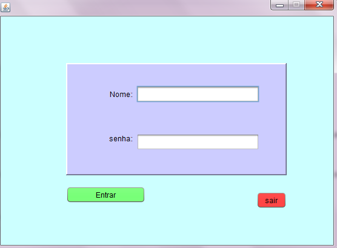

#### 2 Tela principal
Para acessar todas as outras interfaces.

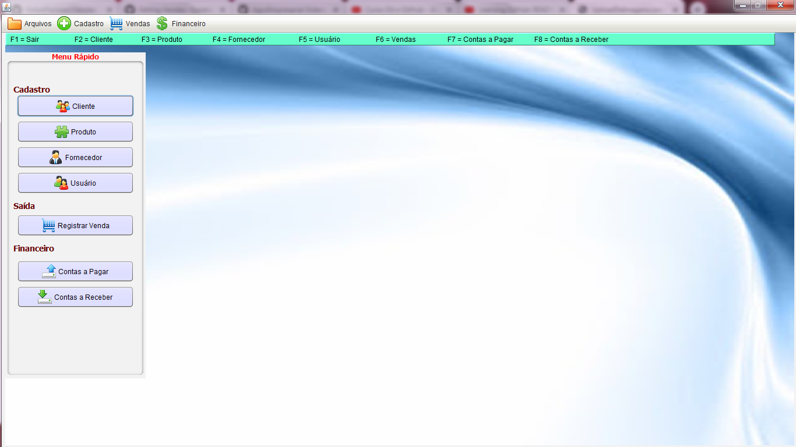

#### 3 Clientes
Faz o cadastro de clientes.

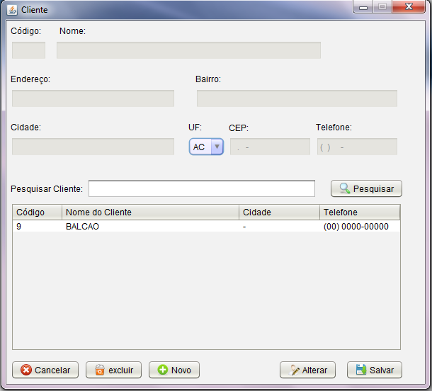

#### 4 Produtos
Faz o cadastro de produtos.

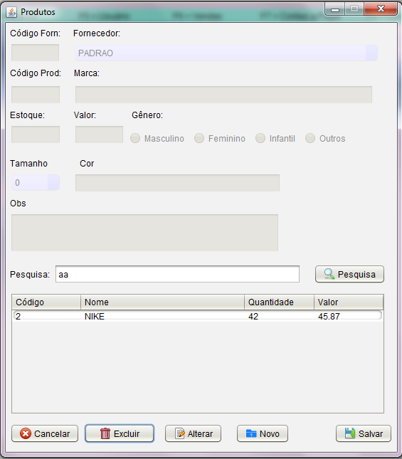

#### 5 Fornecedor
Faz o cadastro de fornecedores.

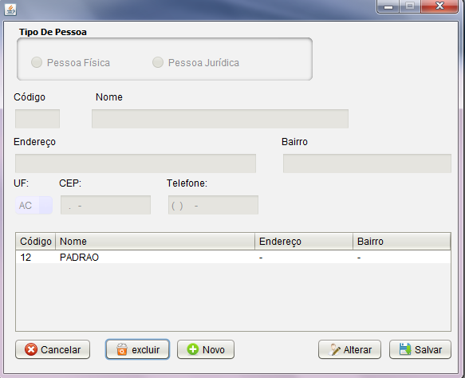

#### 6 Usuário

Faz o cadastro de usuários.

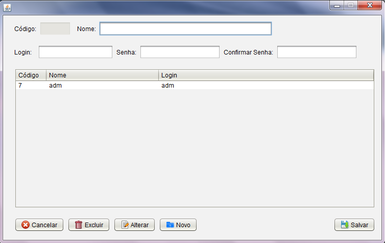

#### 7 Vendas

Realiza vendas.

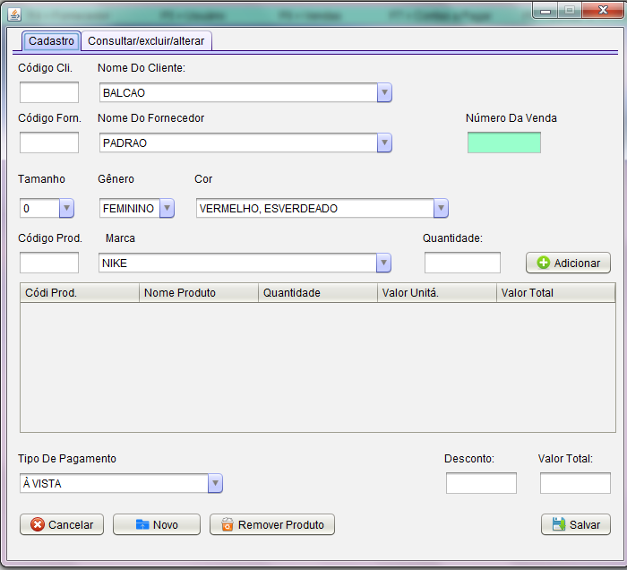

#### 8 Contas para pagar
Faz o pagamento de contas.

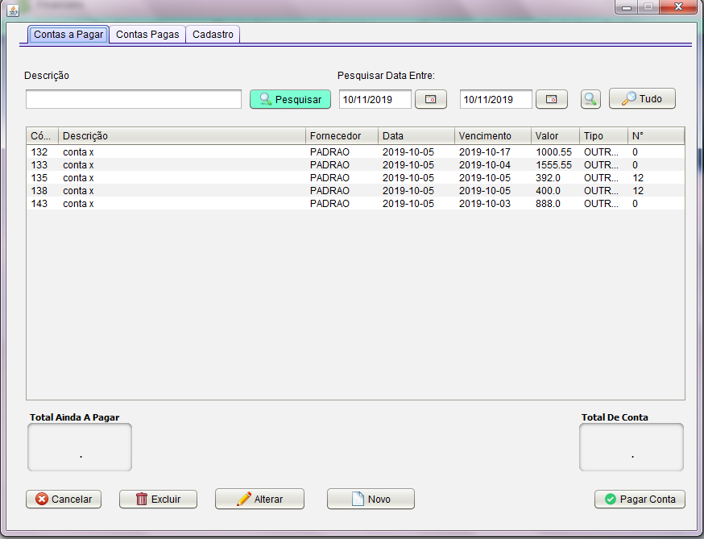

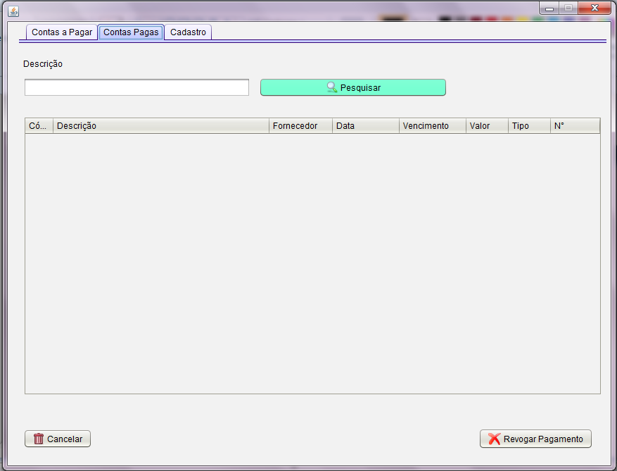

#### 9 Contas para receber
Faz o recebimento de contas.

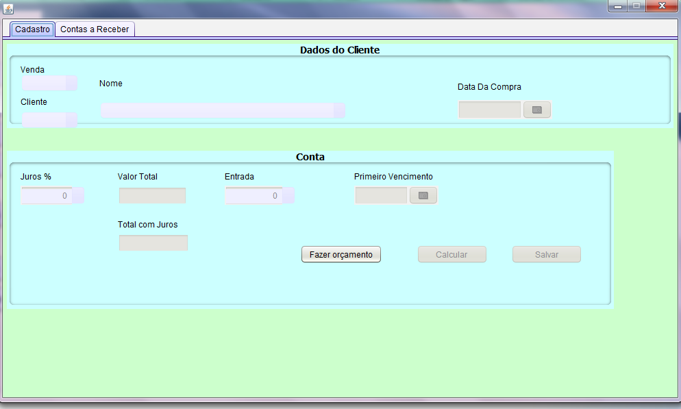
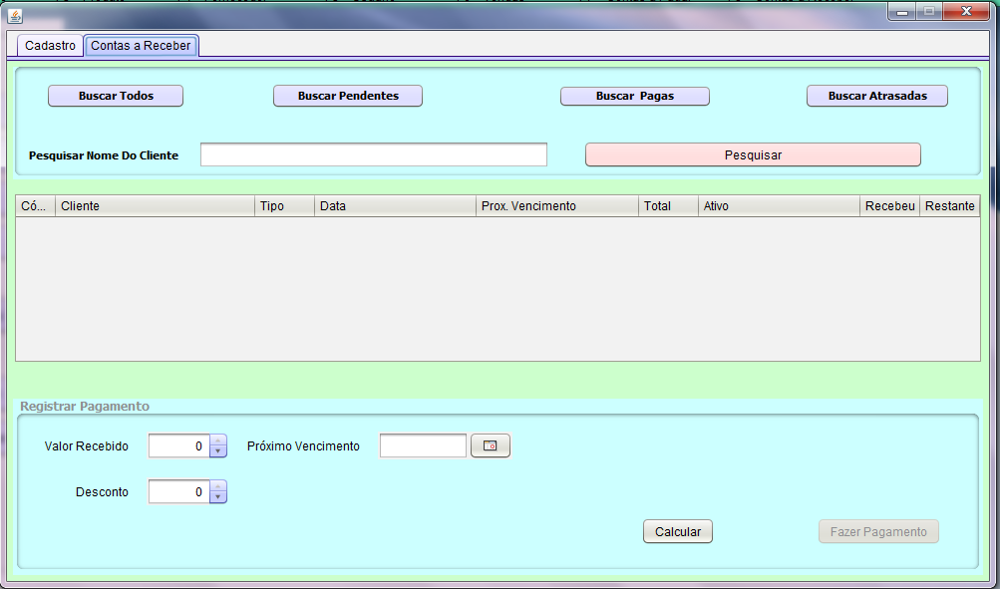

###### OBS
##### O sistema foi desenvolvido tendo o apoio das vídeos aulas do canal "Simplesmente Java"
segue o link: https://www.youtube.com/playlist?list=PLt2CbMyJxu8iQL67Am38O1j5wKLf0AIRZ 
